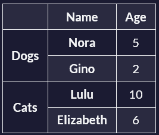

# Trabajar con tablas y formularios accesibles

En estos vídeos didácticos aprenderá a crear tablas y formularios accesibles.

## ¿Cuáles son las mejores prácticas en materia de tablas y accesibilidad?

Cuando vemos una tabla, inmediatamente empezamos a hacer asociaciones visuales entre los datos y los encabezados.

Por ejemplo, supongamos que tenemos una tabla que representa a nuestras mascotas. Tenemos dos perros y dos gatos y la tabla nos muestra sus nombres y edades. Mientras que una persona vidente puede ser capaz de entender las relaciones en esta tabla, hacer las conexiones entre los valores y los encabezados es mucho más difícil para las personas que utilizan lectores de pantalla para navegar por la tabla.

Como desarrollador web, eres el encargado de crear estas asociaciones y estructurar tu marcado HTML de forma que también sea fácil de interpretar para los usuarios de lectores de pantalla.

Veamos cómo crear tablas accesibles que todo el mundo pueda entender. La primera buena práctica que vamos a cubrir es el uso del pie de tabla. Con el elemento caption, puedes escribir el título de una tabla para que los usuarios, especialmente los que utilizan tecnologías de asistencia, puedan entender rápidamente el propósito y el contenido de la tabla. El elemento caption debe colocarse inmediatamente después de la etiqueta de apertura de la tabla. De este modo, los lectores de pantalla y otras tecnologías de asistencia pueden proporcionar más contexto anunciando el pie de foto antes de leer el contenido.

- **Codigo Ejemplo**
  
  ```html
  <table>
    <caption>Our Pets</caption>
    <!-- Table Rows and Columns -->
  </table>
  ```

Hablemos ahora de las cabeceras de fila y columna. Las cabeceras son celdas especiales, que suelen encontrarse al principio de una fila o columna, y que describen el tipo de datos almacenados en la fila o columna. Puedes definir una cabecera de fila o columna con el elemento de cabecera de tabla, `th`.

Por ejemplo, el código siguiente crea una tabla para dos mascotas. Cada fila tiene una cabecera de fila (el nombre de la mascota) y cada columna tiene una cabecera de columna, que describe lo que representan los datos de la columna (edad y tipo).

- **Codigo Ejemplo**
  
  ```html
  <table>
    <caption>Our Pets</caption>
    <thead>
      <tr>
        <!-- Column Headers -->
        <th>Name</th>
        <th>Age</th>
        <th>Type</th>
      </tr>
    </thead>
    <tbody>
      <tr>
        <th>Nora</th> <!-- Row Header -->
        <td>5</td>
        <td>Dog</td>
      </tr>
      <tr>
        <th>Gino</th> <!-- Row Header -->
        <td>2</td>
        <td>Cat</td>
      </tr>
    </tbody>
  </table>
  ```

Observe que el código anterior tiene un elemento `caption` inmediatamente después del elemento de apertura de la `table`. Después, dentro del elemento cabeza de tabla (`thead`), tiene las cabeceras de las columnas (`Name`, `Age` y `Type`). En la segunda y tercera filas, dentro del elemento cuerpo de la tabla (`tbody`), encontramos los datos de cada una de nuestras mascotas. Los nombres de las mascotas son las cabeceras de las filas porque están dentro de elementos de cabecera de tabla (`th`).

Asociar las celdas de datos con sus correspondientes cabeceras también es muy importante para los lectores de pantalla. El atributo `scope` determina si un encabezado es de fila o de columna. Los lectores de pantalla pueden adivinarlo correctamente a partir de la estructura de la tabla, pero suele recomendarse indicar explícitamente el ámbito para garantizar la claridad.

El atributo `scope` tiene cuatro valores posibles. Los dos que utilizarás con más frecuencia son `col` para columna y `row` para fila. En el código siguiente, puede ver que hemos añadido el atributo `scope` a las cabeceras de columna y fila. Las tres cabeceras de columna (`Name`, `Age` y `Type`) tienen un ámbito de `col`, columna.

Las dos cabeceras de fila (`Nore` y `Gino`) tienen un `scope` de `row`.

- **Codigo Ejemplo**
  
  ```html
  <table>
    <caption>Our Pets</caption>
    <thead>
      <tr>
        <!-- Now they have scope -->
        <th scope="col">Name</th>
        <th scope="col">Age</th>
        <th scope="col">Type</th>
      </tr>
    </thead>
    <tbody>
      <tr>
        <th scope="row">Nora</th>
        <td>5</td>
        <td>Dog</td>
      </tr>
      <tr>
        <th scope="row">Gino</th>
        <td>2</td>
        <td>Cat</td>
      </tr>
    </tbody>
  </table>
  ```

Si un encabezado de columna o fila abarca varias celdas, el ámbito(`scope`) también se aplicará a cada una de las celdas individualmente. He aquí un ejemplo de ello:



En esta tabla, la celda con la edad de `Nora` (`5`) tendrá un encabezado de columna (`Age`) y dos encabezados de fila (`Dogs` y `Nora`). La edad de `Gino` (`2`) también tendrá un encabezado de columna (`Age`) y dos encabezados de fila (`Dogs` y `Gino`).

Sin embargo, algunos lectores de pantalla pueden no ser capaces de interpretar tablas con estructuras complejas, por lo que también debe tratar de aplanar la tabla tanto como sea posible para evitar encabezados de fila y columna que se extienden a través de múltiples celdas.

Su objetivo debe ser siempre asegurarse de que los usuarios puedan acceder a esta información, incluso si sus lectores de pantalla pueden manejar estructuras de tabla complejas.

Ahora, para el ancho de celda, se recomienda evitar el uso de valores fijos. En su lugar, debería utilizar valores relativos, como porcentajes. Asimismo, trate de evitar definir la altura de la celda. Esto permitirá a los usuarios ajustar el tamaño del texto a sus necesidades.

Por último, siempre que sea posible, deje que el navegador determine el ancho de la tabla para reducir la necesidad de desplazarse horizontalmente.

Las tablas HTML son esenciales para presentar datos estructurados en un formato accesible y comprensible. Si sigues estas pautas de accesibilidad, podrás crear tablas fáciles de entender para todo el mundo.

## Cuestionario 1

- **¿Qué elemento HTML se utiliza para especificar el título de una tabla?**

  - a) `thead`
  - b) `caption` // correcto
  - c) `tbody`
  - d) `tr`

- **¿Para qué sirve el atributo `scope` en una celda de encabezado de tabla (`th`)?**

  - a) Para especificar el `colspan` y el `rowspan` de la celda.
  - b) Para indicar si la cabecera se aplica a una fila o a una columna. // correcto
  - c) Para definir el estilo de la celda de cabecera.
  - d) Para añadir un tooltip a la celda de cabecera.

- **¿Cuál de las siguientes es una buena práctica para crear tablas accesibles?**

  - a) Uso de cabeceras de tabla complejas y largas.
  - b) No proporcionar texto alternativo para las imágenes dentro de las celdas de las tablas.
  - c) Utilización de estructuras de tabla sencillas con cabeceras de fila y columna. // correcto
  - d) Anidamiento de tablas dentro de tablas.

## ¿Por qué es importante que las entradas(*input*) tengan una etiqueta(*label*) asociada?

Las etiquetas en los campos de entrada pueden parecer pequeños detalles, pero desempeñan un papel crucial a la hora de hacer que los formularios sean más fáciles de usar para todo el mundo.

Las etiquetas ayudan a las personas con discapacidad, hacen que los formularios sean más fáciles de usar para todos y, en última instancia, mejoran las tasas de conversión de los formularios.

Veamos por qué añadir etiquetas a los elementos de entrada es importante para la accesibilidad y la usabilidad.

Los lectores de pantalla a menudo se basan en etiquetas para describir el propósito de los campos de entrada. Para que esto funcione correctamente, la etiqueta debe estar asociada al `input` mediante programación. Aunque hay varias formas de hacerlo, la más común es utilizar el elemento HTML `label`.

A continuación se explica cómo asociar una `label` a una `input`:

- **Codigo Ejemplo**
  
  ```html
  <form>
    <label for="name">Your Name</label>
    <input type="text" id="name" />
  </form>
  ```

En este ejemplo, el atributo `for` del elemento `label` se asocia con el `id` del elemento `input`. Esta conexión permite a los lectores de pantalla anunciar la `label` cuando la `input` está en un estado enfocado, permitiendo a los usuarios de lectores de pantalla entender el propósito de la `input`.

Asociar etiquetas a todos los campos de entrada también beneficia al SEO. Con las etiquetas adecuadas, los motores de búsqueda entenderán mejor el contenido de la página, lo que tendrá un impacto positivo en la clasificación de búsqueda de la página.

Pero es importante entender que usted está haciendo el contenido para los seres humanos, no los motores de búsqueda. Por lo tanto, debe asegurarse de que las etiquetas sean lo más claras y descriptivas posible.

## Cuestionario 2

- **¿Por qué es importante para la accesibilidad añadir etiquetas a los elementos de entrada?**

  - a) Proporcionan un estilo visual a los campos de entrada.
  - b) Ayudan a los lectores de pantalla a describir el propósito de los campos de entrada. // correcto
  - c) Aumentan la velocidad de carga de las páginas web.
  - d) Permiten que los campos de entrada acepten varios tipos de datos.

- **¿Cómo mejoran los labels asociados a los inputs la navegación con el teclado?**

  - a) Mejoran el aspecto visual de los campos de entrada.
  - b) Permiten a los usuarios desplazarse por los campos de entrada sin perderse. // correcto
  - c) Reducen la necesidad de utilizar atajos de teclado.
  - d) Permiten que los campos de entrada acepten caracteres especiales.

- **¿Cómo ayudan las etiquetas asociadas a los campos de entrada a identificar errores?**

  - a) Permiten que los campos de entrada acepten texto más largo.
  - b) Ayudan a los lectores de pantalla a anunciar la etiqueta junto con el mensaje de error. // correcto
  - c) Impiden que los usuarios envíen formularios.
  - d) Hacen que los campos de entrada sean más vistosos.
