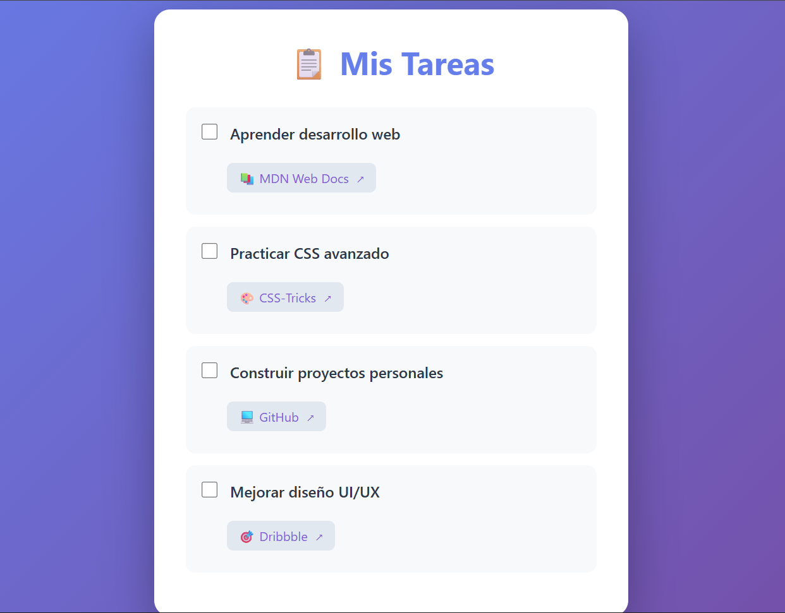

# Crea una lista de tareas estilizada

Crea una aplicación que sea funcionalmente similar a este proyecto de ejemplo. Intenta no copiar el proyecto de ejemplo, dale tu propio estilo personal.

En este laboratorio, practicarás los diferentes estilos que se pueden aplicar a los enlaces cuando se pasa el cursor por encima, se seleccionan, se hacen clic y se visitan.

*Objetivo: Cumple con las historias de usuario que se indican a continuación y supera todas las pruebas para completar el laboratorio.*

## Historias de usuario

- 1.Debes tener una lista desordenada con la clase todo-list.

- 2.Dentro de la lista desordenada, debes tener cuatro elementos de lista.

- 3.Dentro de cada elemento de lista, debe haber:

  - Un elemento de `input` con el tipo `checkbox` y el `id` establecido en un valor único.
  - Un elemento de `label` con el atributo `for` establecido en el `id` del elemento `input` correspondiente.
  - Una lista desordenada con la clase `sub-item`.
  - Un elemento de lista con un elemento de anclaje en su interior. El anclaje debe tener la clase `sub-item-link`, un valor `href` válido y un valor de `target` que haga que el enlace se abra en una nueva pestaña.

- 4.Tus elementos `a` no deben tener ninguna decoración de texto.

- 5.Debes establecer el color del texto de los enlaces no visitados en un color de tu elección.

- 6.Cuando se visitan tus enlaces, el color debe cambiar a otro color de tu elección.

- 7.Cuando se pasa el cursor por encima de los enlaces, el color debe cambiar a otro color de su elección.

- 8.Cuando los enlaces están enfocados, debe haber un contorno de color alrededor del enlace.

- 9.Cuando se hace clic en los enlaces, el color debe cambiar a otro color de su elección.

**Nota: Asegúrese de vincular su hoja de estilos en su HTML y aplicar su CSS.**

