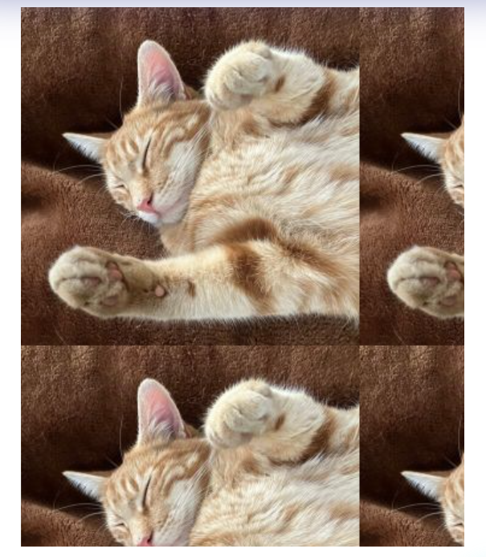
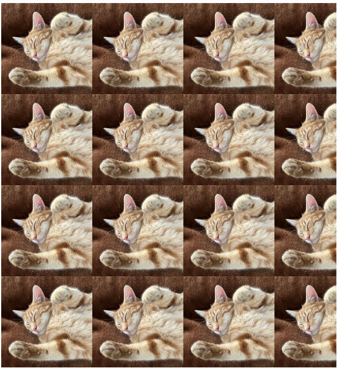

# Trabajamos con `Backgrounds` y `Borders`

## Navegación

- [Trabajamos con `Backgrounds` y `Borders`](#trabajamos-con-backgrounds-y-borders)
  - [Navegación](#navegación)
  - [¿Cómo funcionan el tamaño, la repetición, la posición y la fijación de las imágenes de fondo?](#cómo-funcionan-el-tamaño-la-repetición-la-posición-y-la-fijación-de-las-imágenes-de-fondo)
  - [Cuestionario 1](#cuestionario-1)
  - [¿Qué es un degradado de fondo y cómo funciona?](#qué-es-un-degradado-de-fondo-y-cómo-funciona)
  - [Cuestionario 2](#cuestionario-2)
  - [¿Cuáles son algunas consideraciones de accesibilidad para los fondos?](#cuáles-son-algunas-consideraciones-de-accesibilidad-para-los-fondos)
  - [Cuestionario 3](#cuestionario-3)
  - [¿De qué maneras se pueden añadir bordes alrededor de las imágenes?](#de-qué-maneras-se-pueden-añadir-bordes-alrededor-de-las-imágenes)
  - [Cuestionario 4](#cuestionario-4)

---

En esta sección, elevamos nuestras habilidades de CSS más allá de lo básico para aprender a construir interfaces visualmente dinámicas y accesibles. Hemos explorado cómo transformar contenedores simples en piezas de diseño funcional mediante cuatro pilares fundamentales:

- **Arquitectura de Fondos**: Aprendimos a dominar la imagen de fondo no solo como un adorno, sino como una herramienta adaptable. Desde el control del tamaño y repetición, hasta el posicionamiento preciso y el efecto cinematográfico de la fijación (parallax) durante el scroll.

- **Gradientes Dinámicos**: Descubrimos la potencia de los degradados lineales y radiales, permitiéndonos crear profundidad y modernidad sin depender de archivos de imagen pesados.

- **Diseño Responsable y Accesible**: Entendimos que la estética no sirve de nada sin legibilidad. Analizamos las pautas WCAG para garantizar que el contraste entre fondos y textos permita que cualquier usuario, sin importar sus capacidades visuales, pueda consumir el contenido.

- **Enmarcado y Geometría (Borders)**: Finalmente, exploramos el "Box Model" a través de los bordes y contornos (outlines), aprendiendo a definir límites, estilos independientes y a suavizar interfaces mediante el uso estratégico de radios de curvatura.

---

## ¿Cómo funcionan el tamaño, la repetición, la posición y la fijación de las imágenes de fondo?

Cuando se trabaja con imágenes de fondo en CSS, se dispone de varias propiedades para controlar cómo se muestran estas imágenes.

Las principales propiedades en las que nos centraremos son `background-size`, `background-repeat`, `background-position` y `background-attachment`.

Veamos primero la propiedad `background-image`:

- **Codigo Ejemplo**
  
  ```html
  <style>
    body {
      background-image: url("https://cdn.freecodecamp.org/curriculum/cat-photo-app/relaxing-cat.jpg");
    }
  </style>
  ```



El CSS anterior establece una imagen de fondo de un gato para el elemento `body`.

Si quieres establecer el tamaño de la imagen de fondo, puedes utilizar la propiedad `background-size`.

Puedes utilizar `contain` para escalar la imagen lo máximo posible sin recortarla ni estirarla.

Aquí tienes un ejemplo con `background-size: contain`:

- **Codigo Ejemplo**
  
  ```html
  <style>
    body {
      background-image: url("https://cdn.freecodecamp.org/curriculum/cat-photo-app/relaxing-cat.jpg");
      background-size: contain;
      min-height: 100px;
    }
  </style>
  ```



Estamos estableciendo la `min-height` en `100px` para que la imagen de fondo sea visible y el diseño mantenga una altura de referencia, lo que garantiza que, incluso con un contenido mínimo, el diseño resulte equilibrado y visualmente atractivo.

Si cambiamos la propiedad `background-size` para utilizar el valor `cover`, la imagen de fondo se escalará para cubrir todo el elemento body, manteniendo su relación de aspecto.

- **Codigo Ejemplo**
  
  ```html
  <style>
    body {
      background-image: url("https://cdn.freecodecamp.org/curriculum/cat-photo-app/relaxing-cat.jpg");
      background-size: cover;
      min-height: 100px;
    }
  </style>
  ```

En los ejemplos anteriores, probablemente hayas notado que la imagen de fondo se repite continuamente.

De forma predeterminada, las imágenes de fondo se repiten tanto horizontal como verticalmente para llenar todo el elemento. Sin embargo, puedes controlar este comportamiento.

Puedes utilizar la propiedad `background-repeat` con el valor establecido en `no-repeat`.

- **Codigo Ejemplo**
  
  ```html
  <style>
    body {
      background-image: url("https://cdn.freecodecamp.org/curriculum/cat-photo-app/relaxing-cat.jpg");
      background-size: contain;
      background-repeat: no-repeat;
      min-height: 100px;
    }
  </style>
  ```

Con el `background-size` establecido en `contain` y el `background-repeat` establecida en `no-repeat`, la imagen ya no se repetirá en la pantalla.

Si desea repetir la imagen de fondo horizontalmente, puede utilizar el valor `repeat-x` para la propiedad `background-repeat`.

- **Codigo Ejemplo**
  
  ```html
  <style>
    body {
      background-image: url("https://cdn.freecodecamp.org/curriculum/cat-photo-app/relaxing-cat.jpg");
      background-size: contain;
      background-repeat: repeat-x;
      min-height: 100px;
    }
  </style>
  ```

Si desea repetir la imagen de fondo verticalmente, puede utilizar el valor `repeat-y` para la propiedad `background-repeat`.

- **Codigo Ejemplo**
  
  ```html
  <style>
    body {
      background-image: url("https://cdn.freecodecamp.org/curriculum/cat-photo-app/relaxing-cat.jpg");
      background-size: contain;
      background-repeat: repeat-y;
      min-height: 100px;
    }
  </style>
  ```

Para colocar una imagen de fondo en la pantalla, puede utilizar la propiedad `background-position`.

La propiedad `background-position` le permite establecer en qué parte del elemento aparecerá la imagen de fondo. Puede utilizar palabras clave como `top`, `bottom`, `left`, `right` y `center`, o valores específicos en píxeles o porcentajes.

A continuación se muestra un ejemplo en el que se utilizan `center` y `top` para el `background-position`:

- **Codigo Ejemplo**
  
  ```html
  <style>
    body {
      background-image: url("https://cdn.freecodecamp.org/curriculum/cat-photo-app/relaxing-cat.jpg");
      background-size: contain;
      background-repeat: no-repeat;
      background-position: center top;
      min-height: 100px;
    }
  </style>
  ```

Este código CSS coloca la imagen de fondo en el centro del elemento horizontalmente y en la parte superior verticalmente.

Por último, `background-attachment` determina si la imagen de fondo se desplaza con el contenido o permanece fija cuando se desplaza la página.

Los valores principales son `scroll` (predeterminado), donde la imagen de fondo se desplaza con el contenido, y `fixed`, donde la imagen de fondo permanece en la misma posición en la pantalla.

A continuación se muestra un ejemplo en el que se utiliza el valor `fixed` para la propiedad `background-attachment`:

- **Codigo Ejemplo**
  
  ```html
  <style>
    body {
      background-image: url("https://cdn.freecodecamp.org/curriculum/cat-photo-app/relaxing-cat.jpg");
      background-position: center top;
      background-attachment: fixed;
    }
  </style>
  ```

Este código CSS establece que la imagen de fondo permanezca fija en su lugar incluso cuando se desplaza la página.

Si desea combinar varias propiedades en una sola línea, puede hacerlo utilizando la propiedad abreviada `background`.

A continuación se muestra un ejemplo:

- **Codigo Ejemplo**
  
  ```html
  <style>
    body {
      background: center top fixed
      url("https://cdn.freecodecamp.org/curriculum/cat-photo-app/relaxing-cat.jpg");
    }
  </style>
  ```

El ejemplo anterior combina las propiedades `background-image`, `background-position` y `background-attachment` en una sola línea.

Al dominar estas propiedades, tendrás un gran control sobre cómo se muestran las imágenes de fondo en tus diseños web, lo que te permitirá crear diseños más atractivos y funcionales.

[☝️](#trabajamos-con-backgrounds-y-borders)

---

## Cuestionario 1

- **1.¿Qué valor de `background-size` utilizarías para garantizar que toda la imagen de fondo sea visible sin recortes, incluso si no cubre todo el elemento?**

  - [ ] a) `cover`
  - [x] b) `contain` //correcto
  - [ ] c) `auto`
  - [ ] d) `100%`

- **2.Si quieres que una imagen de fondo se repita horizontalmente pero no verticalmente, ¿qué valor de `background-repeat` usarías?**

  - [ ] a) `repeat`
  - [ ] b) `no-repeat`
  - [x] c) `repeat-x` //correcto
  - [ ] d) `repeat-y`

- **3.¿Qué valor de `background-attachment` utilizarías para que una imagen de fondo permaneciera en su lugar cuando el usuario se desplaza por la página?**

  - [ ] a) `scroll`
  - [x] b) `fixed` //correcto
  - [ ] c) `local`
  - [ ] d) `static`

[☝️](#trabajamos-con-backgrounds-y-borders)

---

## ¿Qué es un degradado de fondo y cómo funciona?

Un degradado de fondo en CSS es una transición suave entre dos o más colores que se puede aplicar al fondo de un elemento. Los degradados permiten crear fondos visualmente atractivos sin necesidad de imágenes.

Hay dos tipos principales de degradados en CSS: `linear-gradient` y `radial-gradient`.

Un `linear-gradient` realiza una transición de colores a lo largo de una línea recta. Se puede definir la dirección y los colores que se utilizan.

Esta es la sintaxis básica:

- **Codigo Ejemplo**
  
  ```css
  background: linear-gradient(direction, color-stop1, color-stop2, ...);
  ```

En este ejemplo, utilizamos la propiedad CSS `background` con un valor de `linear gradient`.

La dirección especifica la dirección del degradado. Puede ser un ángulo (como `45deg`), una palabra clave (como `to right`, `to bottom`) o un lado/esquina.

`color-stop` especifica los colores y las posiciones en las que se producen las transiciones del degradado.

Para comprender mejor cómo funcionan los `linear-gradient`, veamos el siguiente ejemplo:

- **Codigo Ejemplo**
  
  ```html
  <link rel="stylesheet" href="styles.css">
  <div class="linear-gradient"></div>
  ```

  ```css
  .linear-gradient{
    background: linear-gradient(to right, red, yellow);
    height: 40vh;
  }
  ```

Este CSS crea un `linear-gradient` que pasa del `red` a la `left` al `yellow` a la `right`. El degradado se aplica a un elemento con una altura del `40%` de la altura de la ventana gráfica. Aprenderás más sobre las unidades `vh` en una lección futura.

La dirección `to right` significa que el degradado se extiende horizontalmente de izquierda a derecha.

Otro tipo de degradado sería el `radial-gradient`.

Un `radial-gradient` transiciona los colores irradiando desde un origen (normalmente el centro) hacia afuera en forma circular o elíptica.

Esta es la sintaxis básica:

- **Codigo Ejemplo**
  
  ```css
  background: radial-gradient(shape size at position, color-stop1, color-stop2, ...)
  ```

En la sintaxis, el `shape` especifica la forma del degradado, que puede ser un `circle` o `ellipse`.

El `size` determina el tamaño de la forma final del degradado, que puede ser `closest-side`, `closest-corner`, `farthest-side`, `farthest-corner`, `contain`, o `cover`.

La `position` determina la posición del centro del degradado, que se puede especificar mediante palabras clave (como centro, arriba a la `center`, `top left`, `bottom right`) o valores precisos (como `50% 50%`, `10px 20px`).

Por último, las paradas de color son una lista de colores por los que pasa el degradado. Cada parada de color puede incluir opcionalmente un valor de posición (porcentaje o longitud) que indica dónde debe colocarse el color.

Un ejemplo sería:

- **Codigo Ejemplo**

  ```html
  <link rel="stylesheet" href="styles.css">
  <div class="radial-gradient"></div>
  ```

  ```css
  .radial-gradient{
    background: radial-gradient(circle closest-side at center, red, yellow 50%, green);
    height: 60vh;
  }
  ```

Este CSS crea un `radial-gradient circle` centrado en el elemento. Comienza con `red` en el centro, pasa a `yellow` en el `50%` del radio y termina con `green`.

La palabra clave `closest-side` hace que la forma final del degradado se ajuste al lado más cercano del elemento. El degradado se aplica a un elemento con una altura del `60%` de la altura de la ventana gráfica.

Comprender cómo trabajar con degradados CSS puede mejorar significativamente sus diseños, ya que proporciona fondos visualmente atractivos sin necesidad de imágenes.

Con opciones como `linear-gradient` para transiciones suaves y `radial-gradient` para efectos circulares, ofrecen flexibilidad y creatividad en el diseño web.

[☝️](#trabajamos-con-backgrounds-y-borders)

---

## Cuestionario 2

- **1.¿Qué especifica la palabra clave `circle` en una función `radial-gradient()`?**

  - [ ] a) El degradado tendrá forma cuadrada.
  - [ ] b) El gradiente se extenderá en dirección diagonal.
  - [x] c) El gradiente tendrá forma circular. //correcto
  - [ ] d) El degradado se aplicará al texto.

- **2.¿Qué hace la palabra clave `farthest-corner` en el parámetro size de una función `radial-gradient()`?**

  - [ ] a) Hace que el degradado se extienda hasta la esquina más cercana del elemento.
  - [ ] b) Hace que el degradado cubra todo el `width` del elemento.
  - [x] c) Hace que el degradado se extienda hasta la esquina más alejada del elemento. //correcto
  - [ ] d) Hace que el degradado solo aparezca dentro del `padding` del elemento.

- **3.En la función `radial-gradient(circle at center, red, yellow 50%, green)`, ¿dónde se encuentra el centro del gradiente?**

  - [ ] a) En la esquina superior derecha del elemento.
  - [ ] b) En la esquina inferior izquierda del elemento.
  - [x] c) En el centro del elemento. //correcto
  - [ ] d) En el borde exterior del elemento.

[☝️](#trabajamos-con-backgrounds-y-borders)

---

## ¿Cuáles son algunas consideraciones de accesibilidad para los fondos?

En el diseño web, los fondos desempeñan un papel fundamental a la hora de definir el aspecto general de una página web.

Sin embargo, al diseñar con fondos, es fundamental tener en cuenta la accesibilidad para garantizar que el contenido sea utilizable y legible para todos los usuarios, incluidos aquellos con discapacidad visual.

Una de las principales preocupaciones en materia de accesibilidad relacionadas con los fondos es garantizar que haya suficiente contraste entre el fondo y el texto.

Sin un contraste adecuado, los usuarios con discapacidad visual, incluidos aquellos con baja visión o daltonismo, pueden tener dificultades para leer el contenido de su página.

El contraste se refiere a la diferencia de claridad u oscuridad entre dos colores. Un contraste suficiente entre el color de fondo y el color del texto es esencial para la legibilidad.

Las Pautas de Accesibilidad al Contenido en la Web (WCAG) recomiendan una relación de contraste mínima de 4,5:1 para el texto normal y de 3:1 para el texto grande.

Por ejemplo, colocar texto blanco sobre un fondo gris claro daría lugar a un contraste deficiente, lo que dificultaría la lectura del texto. Sin embargo, el texto blanco sobre un fondo azul oscuro proporcionaría un buen contraste, lo que mejoraría la legibilidad para todos los usuarios.

A continuación se muestra un ejemplo de contraste deficiente:

- **Codigo Ejemplo**

  ```html
  <p style="color: lightgray; background-color: whitesmoke;">
     This is an example of poor contrast.
  </p>
  ```

Ahora, aquí hay un ejemplo de buen contraste:

- **Codigo Ejemplo**

  ```html
  <p style="color: white; background-color: darkslategray;">
    This is an example of good contrast.
  </p>
  ```

Otra consideración es evitar colocar texto sobre fondos recargados o complejos, como imágenes o degradados con múltiples colores. Los fondos recargados pueden dificultar la distinción del texto del fondo, independientemente del contraste.

Al diseñar fondos, evite utilizar el color como único medio para transmitir información. Por ejemplo, utilizar solo el color para indicar un mensaje de error o de éxito (como el rojo para los errores o el verde para los éxitos) puede ser problemático para los usuarios con daltonismo.

Además del color, debe utilizar símbolos o texto para transmitir información. Por ejemplo, junto a un mensaje de error en rojo, podría utilizar un icono o texto en negrita para dejar claro que hay un error.

Aunque es menos habitual, el audio o los vídeos de fondo también pueden afectar a la accesibilidad.

La música de fondo o los vídeos que se reproducen automáticamente pueden distraer a algunos usuarios, especialmente a aquellos con discapacidades cognitivas. Si incluye audio de fondo, proporcione siempre a los usuarios una forma de silenciarlo o pausarlo.

Teniendo en cuenta estas consideraciones de accesibilidad, puede crear diseños más inclusivos que garanticen que su contenido sea legible y utilizable por todos los usuarios, independientemente de sus capacidades.

[☝️](#trabajamos-con-backgrounds-y-borders)

---

## Cuestionario 3

- **1.¿Por qué es importante mantener un contraste suficiente entre el texto y el fondo?**

  - [ ] a) Para que la página se vea más colorida.
  - [x] b) Para que el texto sea más fácil de leer para todos los usuarios. //correcto
  - [ ] c) Para reducir los tiempos de carga de la página web.
  - [ ] d) Para resaltar texto de diferentes maneras.

- **2.¿Cuál de las siguientes opciones debe evitarse al colocar texto sobre un fondo?**

  - [ ] a) Aplicar un fondo de alto contraste.
  - [x] b) Usar un fondo recargado o complejo sin ninguna superposición. //correcto
  - [ ] c) Usar texto blanco sobre fondo negro.
  - [ ] d) Usar un color de fondo sólido detrás del texto.

- **3.¿Cuál es el problema de utilizar el color como único indicador de información, como por ejemplo mostrar un mensaje de error en rojo?**

  - [ ] a) Hace que el sitio web parezca menos colorido.
  - [ ] b) No afecta a los usuarios con discapacidad visual.
  - [x] c) Puede resultar problemático para los usuarios con daltonismo. //correcto
  - [ ] d) Requiere más código CSS.

[☝️](#trabajamos-con-backgrounds-y-borders)

---

## ¿De qué maneras se pueden añadir bordes alrededor de las imágenes?

En CSS, hay varias formas de añadir bordes alrededor de las imágenes, cada una de las cuales ofrece diferentes opciones de estilo y niveles de control.

Veamos algunos de los métodos más comunes y versátiles.

La forma más sencilla de añadir un borde a una imagen es utilizando la propiedad border. Esta propiedad es una abreviatura que permite establecer el ancho, el estilo y el color del borde de una sola vez.

- **Codigo Ejemplo**

  ```html
  <link rel="stylesheet" href="styles.css">

  
  ```

  ```css
  img {
    border: 2px solid red;
  }
  ```

Esta regla CSS añade un borde rojo sólido de 2 píxeles de ancho alrededor de todos los elementos `img`. Puede ajustar el ancho, el estilo (como dashed, dotted, o double) y el color para adaptarlo a sus necesidades de diseño.

Si necesita más control sobre los lados individuales del borde, puede utilizar las propiedades específicas del borde para cada lado:

- **Codigo Ejemplo**

  ```html
  <link rel="stylesheet" href="styles.css">

  
  ```

  ```css
  img {
    border-top: 10px solid red;
    border-right: 10px dashed green;
    border-bottom: 10px dotted blue;
    border-left: 10px double purple;
  }
  ```

Esto le permite crear estilos de borde únicos para cada lado de la imagen.

Otra forma de crear un efecto de borde es utilizando la propiedad `outline`. Aunque es similar al borde, el contorno no afecta a las dimensiones ni al diseño del elemento:

- **Codigo Ejemplo**

  ```html
  <link rel="stylesheet" href="styles.css">

  
  ```

  ```css
  img {
    outline: 3px solid gold;
  }
  ```

Esto crea un contorno dorado alrededor de la imagen sin cambiar su tamaño ni su posición.

Si desea crear esquinas redondeadas en el borde, puede utilizar la propiedad `border-radius` junto con border:

- **Codigo Ejemplo**

  ```html
  <link rel="stylesheet" href="styles.css">

  
  ```

  ```css
  img {
    border: 2px solid black;
    border-radius: 10px;
  }
  ```

Recuerda que estas técnicas se pueden combinar y personalizar para crear efectos de borde únicos. La elección del método depende de tus requisitos de diseño específicos y del nivel de complejidad que necesites.

[☝️](#trabajamos-con-backgrounds-y-borders)

---

## Cuestionario 4

- **1.¿Qué propiedad CSS te permite crear un borde que no afecte a las dimensiones del elemento?**

  - [ ] a) `border`
  - [x] b) `outline` //correcto
  - [ ] c) `box-shadow`
  - [ ] d) `border-image`

- **2.¿Cómo crearías un borde rojo discontinuo de 3 píxeles de ancho solo en el lado izquierdo de una imagen?**

  - [ ] a)
          ```css
          img {
            border: 3px dashed red left;
          }
          ```
  - [x] b) //correcto
          ```css
          img {
            border-left: 3px dashed red;
          }
          ```
  - [ ] c)
          ```css
          img {
            left-border: 3px dashed red;
          }
          ```
  - [ ] d)
          ```css
          img {
            border: left 3px dashed red;
          }
          ```

- **3.¿Qué propiedad CSS utilizarías para redondear las esquinas de un borde?**

  - [ ] a) `border-style`
  - [x] b) `border-radius` //correcto
  - [ ] c) `border-spacing`
  - [ ] d) `border-bottom`

[☝️](#trabajamos-con-backgrounds-y-borders)

---
