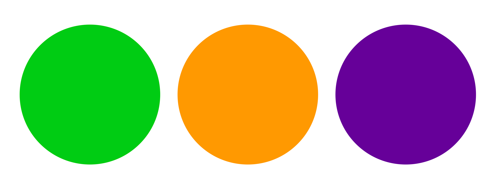
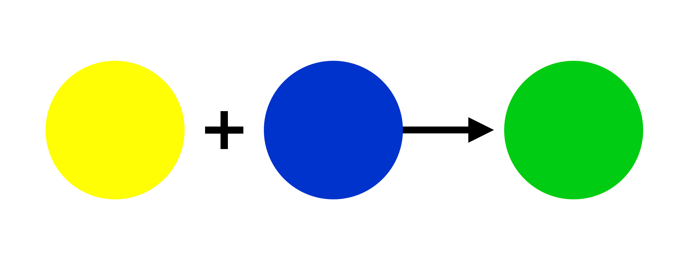
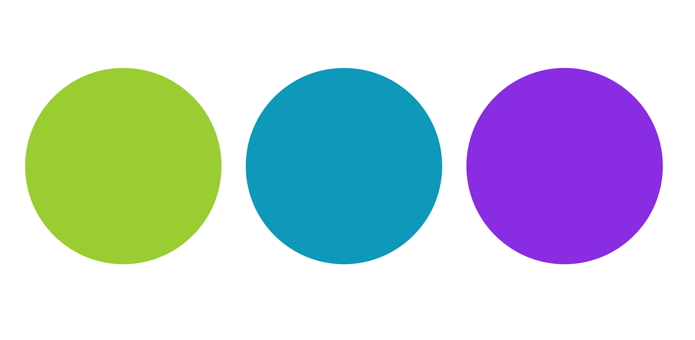
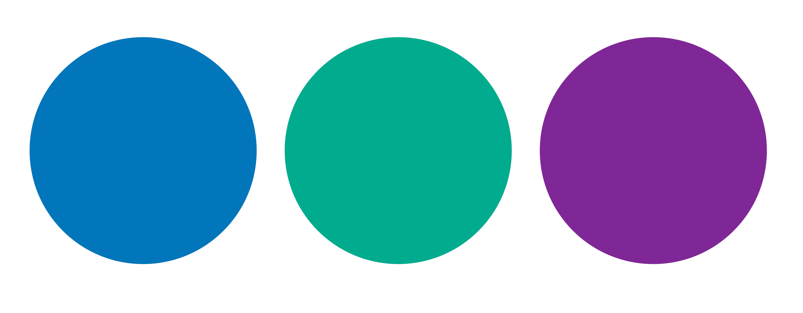
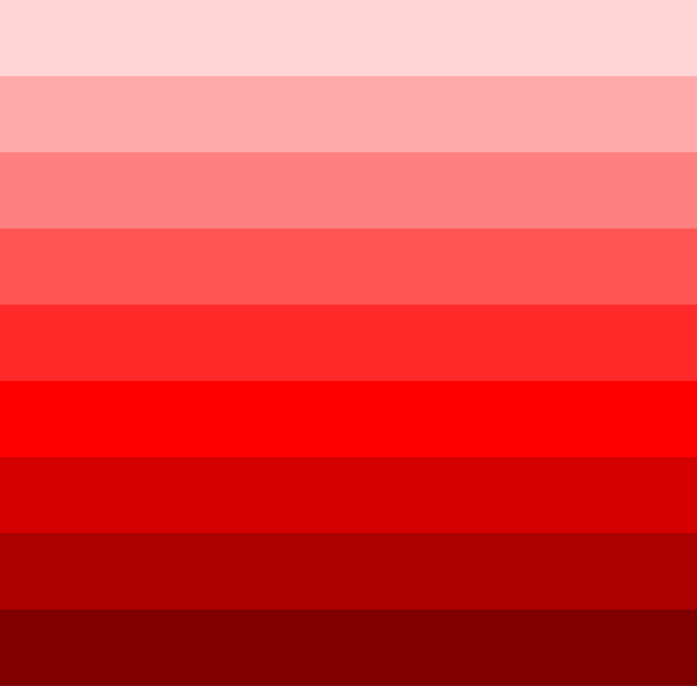

# Trabajar con colores en CSS

---

## Navegación

- [Trabajar con colores en CSS](#trabajar-con-colores-en-css)
  - [Navegación](#navegación)
  - [Tema 1: ¿Qué es la teoría del color en el diseño?](#tema-1-qué-es-la-teoría-del-color-en-el-diseño)
  - [Cuestionario 1](#cuestionario-1)
  - [Tema 2: ¿Qué son los colores con nombre en CSS y cuándo se utilizan?](#tema-2-qué-son-los-colores-con-nombre-en-css-y-cuándo-se-utilizan)
  - [Cuestionario 2](#cuestionario-2)
  - [Tema 3: ¿Qué es el modelo de color RGB y cómo funciona la función RGB en CSS?](#tema-3-qué-es-el-modelo-de-color-rgb-y-cómo-funciona-la-función-rgb-en-css)
  - [Cuestionario 3](#cuestionario-3)
  - [Tema 4: ¿Qué es el modelo de color HSL y cómo funciona la función HSL en CSS?](#tema-4-qué-es-el-modelo-de-color-hsl-y-cómo-funciona-la-función-hsl-en-css)
  - [Cuestionario 4](#cuestionario-4)
  - [Tema 5: ¿Qué son los códigos hexadecimales y cómo funcionan en CSS?](#tema-5-qué-son-los-códigos-hexadecimales-y-cómo-funcionan-en-css)
  - [Cuestionario 5](#cuestionario-5)
  - [Tema 6: ¿Qué son los degradados lineales(`linear-gradient`) y radiales(`radial-gradient`), y cómo funcionan en CSS?](#tema-6-qué-son-los-degradados-linealeslinear-gradient-y-radialesradial-gradient-y-cómo-funcionan-en-css)
  - [Cuestionario 6](#cuestionario-6)

---

En CSS, puedes usar colores de varias maneras para estilizar tus páginas web. Aquí te presento algunas formas comunes de trabajar con colores en CSS:

---

## Tema 1: ¿Qué es la teoría del color en el diseño?

La teoría del color es el estudio de cómo interactúan los colores entre sí y cómo afectan a nuestra percepción. Abarca las relaciones entre los colores, la armonía cromática y el impacto psicológico del color. Empecemos a sumergirnos en este mundo. Los colores se pueden clasificar como primarios, secundarios o terciarios.

Los colores primarios, amarillo, azul y rojo, son los tonos fundamentales de los que se derivan todos los demás colores.


Los colores secundarios se obtienen al mezclar cantidades iguales de dos colores primarios. El verde, el naranja y el morado son ejemplos de colores secundarios.



Por ejemplo, el verde es el resultado de combinar el amarillo y el azul.



Los colores terciarios se obtienen al combinar un color primario con un color secundario adyacente. El amarillo verdoso, el azul verdoso y el azul violáceo son ejemplos de colores terciarios.



Esta es una clasificación fundamental en el mundo de la teoría del color, pero hay otras formas de clasificar los colores. Se pueden clasificar como cálidos o fríos, según su temperatura.


Los colores cálidos, como los rojos, naranjas y amarillos, evocan sensaciones de comodidad, calidez y acogedoridad.



Los colores fríos, como los azules, verdes y morados, evocan sentimientos de calma, serenidad y profesionalismo.

Los colores también se pueden representar mediante modelos de color. Son esenciales para describir y reproducir colores de forma estándar. Entre los modelos de color más utilizados se encuentran el modelo RGB, el modelo HSV y el modelo HSL. Representan los colores basándose en diferentes propiedades. Aprenderás más sobre ellos en futuras lecciones.

Genial. Ahora que ya sabes más sobre esto, hablemos de una herramienta fundamental que utilizan los diseñadores para representar los colores y sus relaciones.

La rueda de colores es un diagrama circular que muestra cómo se relacionan los colores entre sí. Es una herramienta esencial para los diseñadores, ya que les ayuda a seleccionar combinaciones de colores. Esto resulta muy útil para crear paletas y esquemas de colores.


Una combinación de colores es el conjunto de colores elegidos para un diseño o proyecto específico. Por lo general, se basan en los principios de la teoría del color. Al comprender las relaciones entre los colores en la rueda, puedes desarrollar diferentes tipos de combinaciones de colores. Veamos algunas de ellas.

Las combinaciones de colores análogos crean experiencias cohesionadas y relajantes. Tienen colores análogos, que son adyacentes entre sí en la rueda de colores.

Las combinaciones de colores complementarios crean un alto contraste e impacto visual. Sus colores se encuentran en los extremos opuestos de la rueda de colores, uno respecto al otro.

El contraste de colores es esencial para la accesibilidad web. Garantiza que el texto y otros elementos importantes se distingan claramente del fondo. Esto es especialmente importante para las personas con discapacidad visual.

En una rueda de colores RGB, los colores complementarios se encuentran en los extremos opuestos de la rueda. Por ejemplo, el magenta es complementario al verde y el azul es complementario al amarillo, y así sucesivamente.

Una combinación de colores triádica tiene colores vibrantes. Se crean a partir de colores que están aproximadamente equidistantes entre sí. Si se conectan, forman un triángulo equilátero en la rueda de colores.

Y, por último, tenemos la combinación de colores monocromática. En esta combinación, todos los colores se derivan del mismo color base ajustando su luminosidad, oscuridad y saturación. Esto evoca una sensación de unidad y armonía, al tiempo que crea contraste.



Y, por último, aquí tienes algunos consejos para utilizar el color de forma eficaz en el desarrollo web:

- Crea una combinación de colores que defina la imagen de marca de tu sitio web.

- Utiliza los colores para evocar las emociones y percepciones que se ajusten a tus objetivos.

- Elija colores con suficiente contraste para que su sitio web sea accesible para todos.

- Utilice el color para resaltar elementos importantes de su sitio web, como los botones.

- Utilice el color de forma coherente y utilícelo para crear una jerarquía visual.

La teoría del color es un aspecto fundamental del diseño. Al comprender la psicología del color, las armonías y la accesibilidad, puede crear diseños eficaces, evocar emociones y mejorar la experiencia del usuario.

---

## Cuestionario 1

- **1. ¿Por qué es importante la teoría del color para el desarrollo web?**

  - [ ] a) No es importante porque no tiene ningún impacto en la experiencia del usuario.
  - [x] b) Ayuda a los diseñadores a crear sitios web visualmente atractivos. //correcto
  - [ ] c) Solo es importante para el diseño impreso.
  - [ ] d) Es irrelevante para las tendencias actuales en diseño web.

- **2. ¿Qué combinación de colores es más probable que cree experiencias cohesionadas y relajantes?**

  - [x] a) Análogo //correcto
  - [ ] b) Complementario
  - [ ] c) Monocromático
  - [ ] d) Triádico

- **3. El concepto de armonía cromática se refiere a:**

  - [ ] a) Usar solo un color en un diseño.
  - [ ] b) Combinar colores que chocan entre sí.
  - [x] c) Creación de combinaciones de colores visualmente efectivas. //correcto
  - [ ] d) El brillo o la oscuridad de un color.

[☝️](#trabajar-con-colores-en-css)

---

## Tema 2: ¿Qué son los colores con nombre en CSS y cuándo se utilizan?

En CSS, los colores desempeñan un papel crucial en el diseño de páginas web, ya que mejoran la legibilidad, crean ambiente y mejoran la experiencia del usuario. Una de las formas más sencillas de definir colores en CSS es utilizando colores con nombre. Los colores con nombre son nombres de colores predefinidos que reconocen los navegadores. A continuación se muestra un ejemplo del uso de un color con nombre para un elemento de párrafo:

- **Codigo Ejemplo**
  
  ```html
  <link rel="stylesheet" href="styles.css" />
  <p>This is a paragraph.</p>
  ```
  
  ```css
  p {
    color: red;
  }
  ```

En este ejemplo, utilizamos el color `red` para dar estilo al texto de un párrafo.

Los colores con nombre en CSS son una colección de 140 nombres de colores estándar como `red`, `blue`, `yellow`, `aqua`, `fuchsia`, `black`, etc. Estos nombres son fáciles de usar y hacen que el código sea más legible, además de ser autoexplicativos.

Los colores con nombre son útiles para crear prototipos rápidos, diseños sencillos y mejorar la legibilidad del código. Aquí hay otro ejemplo del uso de colores con nombre para un selector `h1`:

- **Codigo Ejemplo**
  
  ```html
  <link rel="stylesheet" href="styles.css" />
  <h1>This is a heading</h1>
  ```
  
  ```css
  h1 {
    color: navy;
    background-color: lightgray;
  }
  ```

En este ejemplo, el texto del encabezado se diseñará en azul marino, con un fondo gris claro. La legibilidad del código mejora, ya que los colores con nombre proporcionan una comprensión visual inmediata del estilo deseado.

Los colores con nombre en CSS son prácticos, pero limitados, ya que solo hay 140 opciones disponibles. Es posible que no ofrezcan el tono preciso necesario para diseños más detallados.

Los colores con nombre en CSS son una forma estupenda de aplicar colores de forma rápida y descriptiva. Aunque son útiles para diseños básicos, prototipos y mejorar la legibilidad del código, su gama limitada los hace menos adecuados para diseños complejos que requieren un control preciso del color.

Al comprender las ventajas y limitaciones de los colores con nombre, podrás determinar cuándo es mejor utilizarlos en lugar de modelos de color más detallados como RGB o HSL, que aprenderás en futuras lecciones.

---

## Cuestionario 2

- **1. ¿Cuál es la principal ventaja de utilizar colores con nombre en CSS?**

  - [ ] a) Los colores con nombre te permiten crear degradados.
  - [x] b) Los colores con nombre son más fáciles de escribir y hacen que el código sea más legible. //correcto
  - [ ] c) Los colores con nombre ofrecen una gama más amplia de opciones de color que los códigos hexadecimales.
  - [ ] d) Los colores con nombre son la forma más precisa de definir los colores en el diseño web.

- **2. ¿En qué situación los colores con nombre podrían no ser la mejor opción?**

  - [ ] a) Cuando necesitas crear rápidamente un prototipo de un diseño.
  - [x] b) Cuando su diseño requiere tonos de color muy específicos o matizados. //correcto
  - [ ] c) Cuando tu diseño solo incluye colores primarios.
  - [ ] d) Cuando colaboras con otras personas en un proyecto sencillo.

- **3. ¿Cuál de los siguientes es un ejemplo de un color con nombre en CSS?**

  - [ ] a) `#ff5733`
  - [ ] b) `rgb(255, 99, 71)`
  - [x] c) tomato //correcto
  - [ ] d) `hsl(120, 100%, 50%)`

[☝️](#trabajar-con-colores-en-css)

---

## Tema 3: ¿Qué es el modelo de color RGB y cómo funciona la función RGB en CSS?

Cuando se trabaja con colores en CSS, es esencial comprender el modelo de color RGB. RGB son las siglas de rojo, verde y azul, los colores primarios de la luz. Estos tres colores se combinan en diferentes intensidades para crear una amplia gama de colores.

El modelo de color RGB es un modelo de color aditivo, lo que significa que los colores se crean combinando luz en diferentes intensidades.

La intensidad de cada color puede variar entre `0` (lo que significa que no hay luz) y `255` (lo que significa luz plena). Al mezclar diferentes niveles de rojo, verde y azul, se puede producir cualquier color que se vea en la pantalla. Por ejemplo:

- El negro se representa con `rgb(0, 0, 0)`, lo que significa que no hay luz para ninguno de los tres colores.

- El blanco se representa con `rgb(255, 255, 255)`, lo que significa intensidad de luz total para los tres colores.

- El rojo se representa con `rgb(255, 0, 0)`, con intensidad total para el rojo y ninguna para el verde o el azul.

En CSS, la función `rgb()` permite definir colores utilizando el modelo de color RGB. La función toma tres valores, cada uno de los cuales representa la intensidad de la luz roja, verde y azul, respectivamente. Esta es la sintaxis básica:

- **Codigo Ejemplo**
  
  ```css
  element {
    color: rgb(red, green, blue);
  }
  ```

Los valores para el rojo, el verde y el azul pueden oscilar entre `0` y `255`, donde `0` representa la ausencia de ese color y `255` representa la saturación total. A continuación se muestra un ejemplo de cómo se puede utilizar la función `rgb()` en CSS:

- **Codigo Ejemplo**
  
  ```html
  <link rel="stylesheet" href="styles.css" />
  <p>This is a paragraph.</p>
  ```

  ```css
  p {
    color: rgb(255, 0, 0);
  }
  ```

Este código cambiaría el color del texto del párrafo a rojo, ya que el valor del rojo se establece en `255`, mientras que el del verde y el azul se establecen en `0`.

CSS también proporciona la función `rgba()`, que añade un cuarto valor, alfa, que controla la transparencia del color. El valor alfa oscila entre `0` (completamente transparente) y `1` (completamente opaco). A continuación se muestra un ejemplo del uso de `rgba()`:

- **Codigo Ejemplo**
  
  ```html
  <link rel="stylesheet" href="styles.css" />
  <div>This is a div.</div>
  ```

  ```css
  div {
    background-color: rgba(0, 0, 255, 0.5);
  }
  ```

Este código aplicaría un fondo azul semitransparente a un elemento `div` porque los valores de rojo y verde se establecen en `0`, el valor de azul se establece en `255` y el valor alfa se establece en `0.5` (50 % de transparencia).

El modelo de color RGB es especialmente útil para los medios digitales porque se corresponde directamente con la forma en que las pantallas muestran los colores. Los monitores y las pantallas utilizan pequeños píxeles rojos, verdes y azules para crear los colores que ves. Al controlar la intensidad de estos píxeles a través de los valores RGB, puedes lograr una amplia gama de colores para tu diseño web.

Además, el modelo RGB es ideal cuando se trabaja con diseños dinámicos. Por ejemplo, si deseas crear animaciones o efectos de color que requieran cambios en tiempo real, la flexibilidad de la función RGB te permite modificar los colores mediante programación.

Al comprender el modelo de color RGB y cómo utilizar las funciones `rgb()` y `rgba()` en CSS, tendrás un mayor control sobre cómo se muestran los colores en tus páginas web. Puedes crear diseños vibrantes, transparencia e incluso ajustar los colores mediante programación para obtener efectos dinámicos.

---

## Cuestionario 3

- **1. ¿Qué representan los números en la función `rgb()`?**

  - [ ] a) `width`, `height`, y `depth` del elemento.
  - [x] b) Cantidad de luz `red`, `green`, y `blue`. //correcto
  - [ ] c) Tamaños de `padding`, `margin`, y `border`
  - [ ] d) Cantidad de `hue`, `saturation`, y `lightness`.

- **2. ¿Qué función CSS utilizarías si quisieras controlar la transparencia de un color?**

  - [ ] a) `rgb()`
  - [x] b) `rgba()` //correcto
  - [ ] c) `hsl()`
  - [ ] d) `hex()`

- **3. ¿Cuál es el valor máximo para cualquier color individual en el modelo RGB?**

  - [ ] a) `100`
  - [ ] b) `50`
  - [x] c) `255` //correcto
  - [ ] d) `360`

[☝️](#trabajar-con-colores-en-css)

---

## Tema 4: ¿Qué es el modelo de color HSL y cómo funciona la función HSL en CSS?

A la hora de diseñar sitios web, una de las formas más versátiles e intuitivas de trabajar con el color es utilizando el modelo de color HSL. HSL son las siglas de _Hue (tono), Saturation (saturación) y Lightness (luminosidad)_, los tres componentes clave que definen un color.

El modelo de color HSL representa los colores de una forma más acorde con la forma en que los seres humanos percibimos el color. En esta lección, exploraremos qué es el modelo de color HSL y cómo se utiliza la función `hsl()` en CSS.

El tono es el tipo de color, representado como un ángulo en la rueda de colores, que va de `0` a `360` grados. Por ejemplo, `0` grados representa el rojo, `120` grados es el verde y `240` grados es el azul. Al ajustar el tono, se cambia entre los diferentes colores del espectro.

La saturación se refiere a la intensidad o pureza del color. Se mide como un porcentaje desde el `0%` (un color completamente desaturado, en escala de grises) hasta el `100%` (la forma más vibrante de ese color). Un color con una saturación del `100%` es totalmente vivo, mientras que un color con una saturación del `0%` aparece como un tono de gris.

La luminosidad determina lo claro u oscuro que es el color, y también se mide en porcentaje. Un valor de luminosidad del `0%` producirá negro, el `50%` dará el tono normal del color y el `100%` dará como resultado blanco.

En CSS, la función `hsl()` se utiliza para definir colores utilizando el modelo de color HSL. Esta es la sintaxis básica:

- **Codigo Ejemplo**
  
  ```css
  element {
    color: hsl(hue, saturation, lightness);
  }
  ```

Analicemos esto con un ejemplo:

- **Codigo Ejemplo**
  
  ```html
  <link rel="stylesheet" href="styles.css" />
  <p>This is a paragraph.</p>
  ```

  ```css
  body {
    background-color: hsla(0, 0%, 1%, 1.00);
  }
  
  p {
    color: hsl(120, 100%, 50%);
  }
  ```

En este caso, el tono es de `120` grados, lo que corresponde al verde. La saturación es del `100%`, por lo que el verde será totalmente intenso. La luminosidad es del `50%`, por lo que tiene un tono normal, ni demasiado oscuro ni demasiado claro. Como resultado, el color del texto del párrafo será un verde brillante.

Una de las principales ventajas del modelo de color HSL es su naturaleza intuitiva. Facilita el ajuste de la intensidad o la luminosidad de un color modificando los valores de saturación y luminosidad sin tener que alterar el color principal (tono).

Por ejemplo, si desea crear diferentes matices o tintes del mismo color, solo tiene que ajustar el valor de luminosidad.

- **Codigo Ejemplo**
  
  ```html
  <link rel="stylesheet" href="styles.css" />
  <div class="light">This is a light blue div.</div>
  <div class="dark">This is a dark blue div.</div>
  ```

  ```css
  div.light {
    background-color: hsl(240, 100%, 80%);
  }
  
  div.dark {
    background-color: hsl(240, 100%, 20%);
    color: hsl(0, 0%, 100%);
  }
  ```

Aquí, ambos elementos `div` utilizan el mismo tono (`240` grados, que es azul), pero uno tiene una luminosidad del `80%` (un tono de azul más claro) y el otro tiene una luminosidad del `20%` (un tono de azul más oscuro).

Al igual que el modelo RGB tiene una función `rgba()` para incluir transparencia, el modelo HSL tiene una función `hsla()`. El cuarto parámetro de esta función representa el valor alfa, que controla la opacidad del color. Esta es la sintaxis básica:

- **Codigo Ejemplo**
  
  ```css
  element {
    background-color: hsla(hue, saturation, lightness, alpha);
  }
  ```

Veamos un ejemplo:

- **Codigo Ejemplo**
  
  ```html
  <link rel="stylesheet" href="styles.css" />
  <div>This is a div.</div>
  ```

  ```css
  div {
    background-color: hsla(0, 100%, 50%, 0.5);
  }
  ```

Este código le daría al `div` un fondo rojo semitransparente, donde el tono se establece en `0` grados (rojo), la saturación es del `100%`, la luminosidad es del `50%` y el alfa es `0,5` (50% de opacidad). También se puede especificar el alfa como porcentaje; por ejemplo, `hsla(0, 100 %, 50 %, 50 %)` es equivalente a `hsla(0, 100 %, 50 %, 0,5)`.

El modelo de color HSL es especialmente útil cuando necesitas crear combinaciones de colores y ajustar tonos o matices fácilmente.

Dado que HSL separa el tono de la saturación y la luminosidad, puedes mantener un tema de color coherente mientras ajustas la luminosidad de las sombras o los reflejos. Este nivel de flexibilidad hace que HSL sea el favorito tanto de diseñadores como de desarrolladores.

Además, HSL hace que los valores de color sean más legibles y comprensibles en comparación con otros métodos como los códigos hexadecimales o RGB. Se puede ver más claramente la intención detrás del color y ajustarlo en consecuencia, especialmente cuando se experimenta con diferentes diseños.

Con el modelo de color HSL, se obtiene más flexibilidad para controlar los tonos, la saturación y la luminosidad del color, lo que lo convierte en una herramienta poderosa para crear diseños ricos y dinámicos en CSS.

---

## Cuestionario 4

- **1. ¿Qué representa el primer valor de la función hsl()?**

  - [ ] a) Saturation
  - [ ] b) Lightness
  - [x] c) Hue //correcto
  - [ ] d) Opacity

- **2. ¿Qué valor porcentual de luminosidad daría como resultado un blanco puro al utilizar el modelo HSL?**

  - [ ] a) `0%`
  - [ ] b) `50%`
  - [x] c) `100%` //correcto
  - [ ] d) `25%`

- **3. ¿Cómo harías un color semitransparente utilizando el modelo HSL?**

  - [x] a) Utilizando `hsla()` y ajustando el valor alfa. //correcto
  - [ ] b) Al reducir el valor de luminosidad en la función `hsl()`
  - [ ] c) Aumentando el valor del tono por encima de los 360 grados.
  - [ ] d) Estableciendo el valor de saturación en 0%.

[☝️](#trabajar-con-colores-en-css)

---

## Tema 5: ¿Qué son los códigos hexadecimales y cómo funcionan en CSS?

Cuando se trabaja con **CSS** para diseñar una página web, uno de los métodos más comunes para definir los colores es utilizar valores de color `hex`. Los valores de color `hexadecimales`, o códigos `hex`, son una forma concisa de representar los colores en el modelo de color **RGB**. En esta lección, exploraremos qué son los códigos `hex`, cómo funcionan en **CSS** y cuándo utilizarlos.

Un código `hex` (abreviatura de código `hexadecimal`) es una cadena de seis caracteres que se utiliza para representar colores en el modelo de color RGB. El término "`hex`" hace referencia al sistema numérico de base 16, que utiliza los dígitos del `0` al `9` y las letras de la `A` a la `F`.

En el contexto de los colores, los códigos `hex` especifican las cantidades de `red`, `green` y `blue` (**RGB**) que componen un color concreto. Cada código `hex` comienza con un símbolo de almohadilla (`#`), seguido de seis caracteres que definen la intensidad del rojo, el verde y el azul en el color.

Por ejemplo, el código hexadecimal del negro es `#000000` y el del blanco es `#FFFFFF`. Los dos primeros caracteres representan el valor del rojo, los dos siguientes representan el verde y los dos últimos representan el azul.

En CSS, se pueden aplicar colores a los elementos utilizando códigos hexadecimales. Esta es la sintaxis básica:

- **Codigo Ejemplo**
  
  ```css
  element {
    color: #RRGGBB;
  }
  ```

Aquí, `#RRGGBB` es un marcador de posición para el código hexadecimal real. Los pares `RR`, `GG` y `BB` representan la intensidad del rojo, el verde y el azul, respectivamente.

Estos pares pueden variar entre `00` (la intensidad más baja) y `FF` (la intensidad más alta). Cuanto mayor sea el número, más presente estará ese color en la mezcla final. Por ejemplo, apliquemos algunos colores hexadecimales a varios elementos:

- **Codigo Ejemplo**
  
  ```html
  <link rel="stylesheet" href="styles.css" />
  <h1>This is a heading.</h1>
  <p>This is a paragraph.</p>
  ```

  ```css
  h1 {
    color: #FF5733; /* A reddish-orange color */
  }
  p {
    background-color: #4CAF50; /* A shade of green */
  }
  ```

En el primer caso, `#FF5733` es un color rojo anaranjado. Aquí está el desglose:

- `FF` es el valor más alto para el rojo (totalmente saturado).
- `57` es una cantidad moderada de verde.
- `33` es una pequeña cantidad de azul.

En el segundo caso, `#4CAF50` es un tono de verde:

- `4C` es un valor bajo para el rojo.
- `AF` es un valor alto para el verde.
- `50` es un valor moderado para el azul.

Los códigos hexadecimales son populares porque son precisos y fáciles de usar. Permiten ajustar los colores con precisión, lo que los hace ideales para diseños en los que la coherencia es importante.

La mayoría de los programas de diseño, como Adobe Photoshop o Figma, proporcionan códigos hexadecimales para los colores que seleccionas, lo que facilita copiar y pegar estos valores directamente en tus archivos CSS.

En el desarrollo web, los códigos hexadecimales se utilizan a menudo para definir los colores del texto, los fondos, los bordes y otros elementos visuales. Por ejemplo:

- **Codigo Ejemplo**
  
  ```html
  <link rel="stylesheet" href="styles.css" />
  <button>Example</button>
  ```

  ```css
  body {
    background-color: #F0F0F0; /* Light gray background */
  }
  
  button {
    background-color: #007BFF; /* A shade of blue */
    color: #FFFFFF; /* White text */
  }
  ```

Esto garantiza que los colores se mantengan uniformes en todo el sitio web o la aplicación.

En algunos casos, es posible que veas códigos hexadecimales escritos en formato abreviado, utilizando solo tres caracteres en lugar de seis. Esto es posible cuando ambos caracteres de cada par de colores son iguales. Por ejemplo, `#FF5733` no se puede abreviar, pero `#FFFFFF` (blanco) se puede escribir como `#FFF`.

- **Codigo Ejemplo**
  
  ```html
  <link rel="stylesheet" href="styles.css" />
  <h2>This is a heading.</h2>
  ```

  ```css
  body {
    background-color: #000;
  }
  
  h2 {
    color: #FFF; /* White in shorthand */
  }
  ```

La abreviatura `#FFF` equivale a `#FFFFFF`. Del mismo modo, `#000` representaría el negro, que es `#000000` en su forma completa.

Los códigos hexadecimales son populares por su precisión y compatibilidad, ya que permiten más de 16 millones de colores en todos los navegadores. Son ideales cuando se necesitan colores específicos para una marca, se desea controlar tonos exactos que no se definen fácilmente con colores nombrados o HSL, o cuando se copian colores de un software de diseño que proporciona códigos hexadecimales de forma predeterminada.

---

## Cuestionario 5

- **1. ¿Qué representa cada par de caracteres en un código hexadecimal?**

  - [ ] a) La cantidad de opacidad en el color.
  - [x] b) La intensidad del rojo, verde o azul en el color. //correcto
  - [ ] c) La cantidad de contraste entre colores.
  - [ ] d) La claridad y la saturación del color.

- **2. ¿Cómo escribirías el código hex para el negro utilizando el formato abreviado?**

  - [x] a) `#000` //correcto
  - [ ] b) `#000000`
  - [ ] c) `#FFF`
  - [ ] d) `#FFFFFF`

- **3. ¿Por qué un diseñador podría optar por utilizar códigos hex en su CSS en lugar de colores con nombre?**

  - [x] a) Los códigos hexadecimales permiten una selección de colores más precisa. //correcto
  - [ ] b) Los códigos hexadecimales son más fáciles de recordar que los nombres de los colores.
  - [ ] c) Los códigos hexadecimales se ajustan automáticamente al modo claro y oscuro.
  - [ ] d) Los códigos hexadecimales no requieren ningún formato en CSS.

[☝️](#trabajar-con-colores-en-css)

---

## Tema 6: ¿Qué son los degradados lineales(`linear-gradient`) y radiales(`radial-gradient`), y cómo funcionan en CSS?

En una lección anterior, aprendiste a empezar a trabajar con degradados lineales y radiales. En esta lección, vamos a profundizar en cómo trabajar con las propiedades **CSS** para crear diseños más atractivos y complejos.

Los degradados en **CSS** te permiten crear transiciones suaves entre dos o más colores específicos. A menudo se utilizan para añadir profundidad, textura e interés visual a los diseños web sin necesidad de utilizar archivos de imagen.

**CSS** admite dos tipos principales de degradados: degradados lineales y degradados radiales.

Los degradados lineales crean una mezcla gradual entre colores a lo largo de una línea recta. Puedes controlar la dirección de esta línea y los colores utilizados. Aquí tienes un ejemplo básico de un degradado lineal:

- **Codigo Ejemplo**
  
  ```html
  <<link rel="stylesheet" href="styles.css" />
  <div class="radial-gradient"></div>
  ```

  ```css
  .radial-gradient {
    background: radial-gradient(circle, red, blue);
    height: 40vh;
  }
  ```

Esto crea un degradado circular que comienza con rojo en el centro y pasa a azul en los bordes. También puede especificar la forma y el tamaño de los degradados radiales:

- **Codigo Ejemplo**
  
  ```html
  <<link rel="stylesheet" href="styles.css" />
  <div class="custom-radial-gradient"></div>
  ```

  ```css
  .custom-radial-gradient {
    background: radial-gradient(ellipse at top left, red, blue);
    height: 40vh;
  }
  ```

Esto crea un degradado elíptico que comienza en la esquina superior izquierda del elemento. Tanto los degradados lineales como los radiales permiten especificar paradas de color en posiciones precisas. Por ejemplo:

- **Codigo Ejemplo**
  
  ```html
  <link rel="stylesheet" href="styles.css" />
  <div class="precise-gradient"></div>
  ```

  ```css
  .precise-gradient {
    background: linear-gradient(to right, red 20%, yellow 40%, blue 80%);
    height: 40vh;
  }
  ```

Esto crea un degradado en el que el rojo ocupa el primer 20%, luego pasa al amarillo en el 40% y, finalmente, al azul en el 80%.

Los degradados se pueden utilizar en cualquier lugar donde se utilice una imagen en CSS. Esto los hace versátiles para crear fondos, botones o incluso efectos de texto cuando se combinan con otras propiedades CSS.

Recuerde que, aunque los degradados pueden mejorar el atractivo visual de su sitio web, es importante garantizar un contraste suficiente para la accesibilidad, especialmente cuando se utilizan degradados detrás del texto.

---

## Cuestionario 6

- **1. ¿Cuál es la diferencia entre los degradados lineales y radiales en CSS?**

  - [ ] a) Los degradados lineales utilizan solo dos colores, mientras que los degradados radiales utilizan varios colores.
  - [x] b) Los degradados lineales se desplazan a lo largo de una línea recta, mientras que los degradados radiales se irradian desde un punto central. //correcto
  - [ ] c) Los degradados lineales solo son horizontales, mientras que los degradados radiales pueden tener cualquier forma.
  - [ ] d) Los degradados lineales son más suaves que los degradados radiales.

- **2. En el siguiente código CSS, ¿qué especifica 45deg?**
  
  ```css
  {
    background: linear-gradient(45deg, red, blue);
  }
  ```

  - [ ] a) El ángulo de rotación de todo el elemento.
  - [x] b) La dirección de la línea de gradiente. //correcto
  - [ ] c) El tamaño del gradiente.
  - [ ] d) La distancia entre las paradas de color.

- **3. ¿Cuál de las siguientes opciones NO es una forma válida de especificar la dirección en un degradado lineal?**

  - [ ] a) `to right`
  - [ ] b) `to bottom left`
  - [ ] c) `90deg`
  - [x] d) `diagonal` //correcto

[☝️](#trabajar-con-colores-en-css)

---
