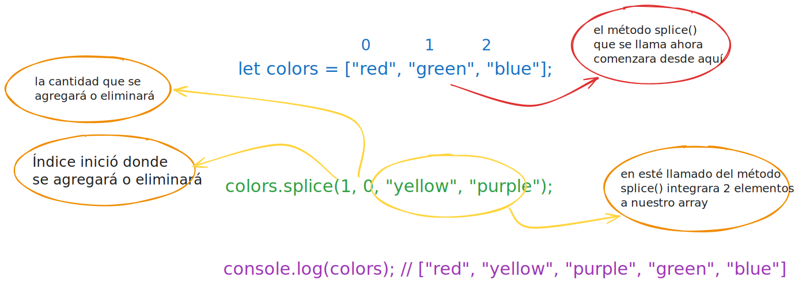

# Trabajar con métodos comunes de arrays

En esta sección, aprenderás a usar métodos comunes de arrays para manipular y trabajar con datos en JavaScript. Los métodos de arrays son funciones integradas que te permiten realizar operaciones como agregar, eliminar, ordenar y transformar elementos en un array de manera eficiente.

---

## Tema 1: ¿Cómo se obtiene el índice de un elemento en un array utilizando el método `indexOf()`?

En JavaScript, el método `indexOf()` es útil para encontrar el primer índice de un elemento específico dentro de un array. Si no se encuentra el elemento, devolverá `-1`. Esta es la sintaxis básica:

- **Example code**

  ```js
  array.indexOf(element, fromIndex)
  ```

`element` representa el valor que deseas buscar dentro del array, y el parámetro `fromIndex` es la posición desde la que debe comenzar la búsqueda. El parámetro `fromIndex` es opcional. Si no se proporciona `fromIndex`, la búsqueda comienza desde el principio de la array. Veamos un ejemplo:

- **Example code**

  ```js
  let fruits = ["apple", "banana", "orange", "banana"];
  let index = fruits.indexOf("banana");
  console.log(index); // 1
  ```

En este ejemplo, tenemos un array `fruits` que contiene varios nombres de frutas. Utilizamos el método `indexOf()` para encontrar el índice del string `banana` dentro del array `fruits`. Dado que `banana` se encuentra en el índice `1`, el método devuelve `1`, valor que se almacena en la variable `index` y se registra en la consola.

Si el elemento que se busca no se encuentra en el array, `indexOf()` devuelve `-1`. Por ejemplo:

- **Example code**

  ```js
  let fruits = ["apple", "banana", "orange"];
  let index = fruits.indexOf("grape");
  console.log(index); // -1
  ```

Aquí buscamos el string `grape` en el array `fruit`s utilizando `indexOf()`. Como `grape` no está presente en le array, el método devuelve `-1`, valor que se almacena en la variable `index` y se registra en la consola.

Si quieres empezar a buscar un elemento a partir de un número de índice específico, puedes pasar un segundo argumento como en este ejemplo:

- **Example code**

  ```js
  let colors = ["red", "green", "blue", "yellow", "green"];
  let index = colors.indexOf("green", 3);
  console.log(index); // 4
  ```

En este ejemplo, la búsqueda no comienza desde el principio del array, sino que empieza en el índice `3`, que es `yellow`, y devuelve el resultado `4`.

---

## Cuestionario 1

1. **¿Cuál será el resultado del siguiente código?**

    ```js
    let numbers = [10, 20, 30, 20, 40];
    let index = numbers.indexOf(20);
    console.log(index);
    ```

    - [ ] a) `0`
    - [x] b) `1` //correcto
    - [ ] c) `2`
    - [ ] d) `3`

2. **¿Cuál será el resultado del siguiente código?**

    ```js
    let fruits = ["apple", "banana", "orange", "grape"];
    let index = fruits.indexOf("kiwi");
    console.log(index);
    ```

    - [ ] a) `0`
    - [x] b) `-1` //correcto
    - [ ] c) `undefined`
    - [ ] d) Se producirá un error

3. **¿Cuál será el resultado del siguiente código?**

    ```js
    let colors = ["red", "green", "blue", "yellow", "green"];
    let index = colors.indexOf("green", 2);
    console.log(index);
    ```

    - [ ] a) `1`
    - [ ] b) `2`
    - [x] c) `4` //correcto
    - [ ] d) `-1`

[☝️](#trabajar-con-métodos-comunes-de-arrays)

---

## Tema 2: ¿Cómo se añaden y eliminan elementos de la parte central de un array?

El método `splice()` de JavaScript es una forma eficaz de modificar arrays. Permite añadir o eliminar elementos desde cualquier posición de un array, incluida la parte central. El valor de retorno del método `splice()` será un array con los elementos eliminados del array. Si no se ha eliminado nada, se devolverá un array vacío.

Es importante tener en cuenta que este método mutará al array original, modificándola in situ en lugar de crear un nuevo array. Esto es algo que hay que tener en cuenta al trabajar con `splice()`. Aquí está la sintaxis básica:

- **Example code**

  ```js
  array.splice(startIndex, itemsToRemove, item1, item2)
  ```

`startIndex` especifica el índice en el que se debe comenzar a modificar el array, mientras que `itemsToRemove` es un parámetro opcional que indica cuántos elementos se deben eliminar. Si se omite `itemsToRemove`, `splice()` eliminará todos los elementos desde `startIndex` hasta el final de la array. Los parámetros siguientes (`item1`, `item2`, etc.) son los elementos que se añadirán al array, comenzando en el índice de inicio.

Comencemos con un ejemplo de cómo eliminar elementos del medio de un array:

- **Example code**

  ```js
  let fruits = ["apple", "banana", "orange", "mango", "kiwi"];
  let removed = fruits.splice(2, 2);
  
  console.log(fruits);  // ["apple", "banana", "kiwi"]
  console.log(removed); // ["orange", "mango"]
  ```

En este ejemplo, `splice(2, 2)` comienza en el índice `2` y elimina `2` elementos. El array modificado ahora estará compuesta únicamente por `apple`, `banana` y `kiwi`. Ahora, veamos cómo añadir elementos en medio de un array:

- **Example code**

  ```js
  let colors = ["red", "green", "blue"];
  colors.splice(1, 0, "yellow", "purple");
  
  console.log(colors); // ["red", "yellow", "purple", "green", "blue"]
  ```



En este caso, `splice(1, 0, "yellow", "purple")` comienza en el índice `1`, elimina `0` elementos e inserta `"yellow"` y `"purple"`. El segundo parámetro (`0`) indica que no se elimina ningún elemento antes de la inserción. También puedes usar `splice()` para eliminar y añadir elementos al mismo tiempo:

- **Example code**

  ```js
  let numbers = [1, 2, 3, 4, 5];
  numbers.splice(1, 2, 6, 7, 8);
  
  console.log(numbers); // [1, 6, 7, 8, 4, 5]
  ```

En este caso, `splice(1, 2, 6, 7, 8)` comienza en el índice `1`, elimina `2` elementos (el `2` y el `3`) e inserta el `6`, el `7` y el `8`. Si necesitas mantener el array original sin cambios, debes crear una copia antes de usar `splice()`:

- **Example code**

  ```js
  let original = [1, 2, 3, 4, 5];
  let copy = [...original];
  copy.splice(2, 1, 6);
  
  console.log(original); // [1, 2, 3, 4, 5]
  console.log(copy);     // [1, 2, 6, 4, 5]
  ```

En este ejemplo, para crear una copia del array `original` sin modificarlo, utilizamos el operador de expansión (`...`). El operador de expansión creará una copia superficial de los elementos del array `original` en un nuevo array. Aprenderás más sobre esto en lecciones futuras.

Cuando usamos `copy.splice(2, 1, 6)`, se modifica el array de copia al eliminar el elemento en el índice `2` (que es `3`) e insertar el nuevo elemento `6` en esa posición.

Un caso de uso común de `splice()` es eliminar un solo elemento de un array cuando conoces su índice:

- **Example code**

  ```js
  let fruits = ["apple", "banana", "orange", "mango"];
  let indexToRemove = fruits.indexOf("orange");
  if (indexToRemove !== -1) {
      fruits.splice(indexToRemove, 1);
  }
  
  console.log(fruits); // ["apple", "banana", "mango"]
  ```

En este ejemplo, primero usamos el método `indexOf()` para encontrar el índice del elemento `orange` en el array `fruits`. El método `indexOf()` devuelve el índice de la primera aparición del elemento dado o `-1` si el elemento no se encuentra en el array.

Luego comparamos `indexToRemove` con `-1` para asegurarnos de que el elemento exista en el array antes de intentar eliminarlo. Si `indexToRemove` no es igual a `-1` (lo que significa que se encuentra el elemento), usamos `splice()` para eliminar un elemento a partir de la posición `indexToRemove`.

También puedes usar `splice()` para borrar un array eliminando todos los elementos:

- **Example code**

  ```js
  let array = [1, 2, 3, 4, 5];
  array.splice(0);
  
  console.log(array); // []
  ```

Aunque `splice()` es muy potente, vale la pena señalar que, en el caso de arrays muy grandes, puede resultar menos eficiente que otros métodos, especialmente al modificar el principio del array. Esto se debe a que `splice()` puede necesitar desplazar todos los elementos posteriores. En tales casos, si solo vas a agregar o eliminar elementos al final de la array, métodos como `push()`, `pop()`, `unshift()` y `shift()` podrían ser más adecuados.

En conclusión, el método `splice()` es una forma versátil de modificar arrays en JavaScript. Permite un control preciso sobre la adición y eliminación de elementos desde cualquier posición en un array. Comprender cómo usar `splice()` de manera efectiva puede mejorar considerablemente su capacidad para manipular arrays en su código JavaScript.

---

## Cuestionario 2

1. **¿Cuál será el resultado del siguiente código?**

    ```js
    let arr = [1, 2, 3, 4, 5];
    arr.splice(2, 0, 6, 7);
    console.log(arr);
    ```

    - [x] a) `[1, 2, 6, 7, 3, 4, 5]` //correcto
    - [ ] b) `[1, 2, 3, 4, 5, 6, 7]`
    - [ ] c) `[1, 2, 3, 6, 7, 4, 5]`
    - [ ] d) `[1, 2, 6, 7, 4, 5]`

2. **¿Cuál de las siguientes llamadas a `splice()` eliminaría el número 3 del array?**

    ```js
    let arr = [1, 2, 3, 4, 5];
    ```

    - [ ] a) `arr.splice(3, 1)`
    - [ ] b) `arr.splice(3, 0)`
    - [x] c) `arr.splice(2, 1)` //correcto
    - [ ] d) `arr.splice(arr.length - 2, 1)`

3. **¿Qué devuelve el método `splice()`?**

    - [ ] a) El array modificado.
    - [ ] b) El número de elementos eliminados.
    - [x] c) Un array que contiene los elementos eliminados. //correcto
    - [ ] d) `undefined`

[☝️](#trabajar-con-métodos-comunes-de-arrays)

---

## Tema 3: ¿Cómo se puede comprobar si un array contiene un valor determinado?

En JavaScript, el método `includes()` es una forma sencilla y eficaz de comprobar si un array contiene un valor específico. Este método devuelve un valor booleano: `true` si el array contiene el elemento especificado y `false` en caso contrario.

El método `includes()` es particularmente útil cuando necesitas verificar rápidamente la presencia de un elemento en un array sin necesidad de conocer su posición exacta. Comencemos con un ejemplo de cómo usar el método `includes()`:

- **Example code**

  ```js
  let fruits = ["apple", "banana", "orange", "mango"];
  console.log(fruits.includes("banana")); // true
  console.log(fruits.includes("grape"));  // false
  ```

En este ejemplo, tenemos un array de frutas. Usamos el método `includes()` para comprobar si `banana` está en el array. Devuelve `true` porque, efectivamente, `banana` está presente. A continuación, comprobamos si está `grape`, lo que devuelve `false` porque no está en el array.

El método `includes()` distingue entre mayúsculas y minúsculas cuando se trata de strings. Esto significa que `Banana` con B mayúscula y `banana` con todas las letras en minúsculas se consideran valores diferentes. A continuación, un ejemplo que ilustra esto:

- **Example code**

  ```js
  let fruits = ["apple", "banana", "orange"];
  console.log(fruits.includes("banana")); // true
  console.log(fruits.includes("Banana")); // false
  ```

En este caso, `banana` (*todo en minúsculas*) se encuentra en el array, pero `Banana` (*con la primera letra mayúscula*) no, por lo que la segunda llamada a `includes()` devuelve `false`.

El método `includes()` también puede aceptar un segundo parámetro opcional que especifica la posición en el array desde donde debe comenzar la búsqueda. Esto resulta útil si deseas comprobar la presencia de un elemento en una parte específica del array. A continuación te mostramos cómo puedes utilizar esta función:

- **Example code**

  ```js
  let numbers = [10, 20, 30, 40, 50, 30, 60];
  console.log(numbers.includes(30, 3)); // true
  console.log(numbers.includes(30, 4)); // true
  ```

En el primer `console.log`, buscamos el número `30` a partir del índice `3`. En este caso, hay un número `30` que aparece después del índice `3`, por lo que el método `includes()` devuelve `true`.

Lo mismo ocurre con el segundo `console.log`. Buscamos el número `30` a partir del índice `4`. Dado que el número `30` aparece después de ese índice, devolverá `true`.

Vale la pena señalar que `includes()` utiliza la comparación de igualdad estricta (`===`), lo que significa que puede distinguir entre diferentes tipos. Por ejemplo:

- **Example code**

  ```js
  let mixedArray = [1, "2", 3, "4", 5];
  console.log(mixedArray.includes(2));  // false
  console.log(mixedArray.includes("2")); // true
  ```

En este caso, el número `2` y el string `"2"` se consideran tipos de datos diferentes. Por lo tanto, el primer `console.log` devolverá `false`, mientras que el segundo `console.log` devolverá `true`.

El método `includes()` es una herramienta poderosa para verificar la presencia de elementos en arrays. Es fácil de usar, eficiente y puede evitarte escribir bucles o condiciones más complejos para buscar en arrays. Ya sea que estés trabajando con strings, números o tipos de datos mixtos, `includes()` ofrece una forma sencilla de verificar si un valor existe en tu array.

---

## Cuestionario 3

1. **¿Cuál será el resultado del siguiente código?**

    ```js
    let arr = [1, 2, 3, 4, 5];
    console.log(arr.includes(3, 3));
    ```

    - [ ] a) `true`
    - [x] b) `false` //correcto
    - [ ] c) `undefined`
    - [ ] d) Esto generará un error.

2. **¿Cuál será el resultado del siguiente código?**

    ```js
    let arr = ["a", "b", "c", "d", "e"];
    console.log(arr.includes("C"));
    ```

    - [x] a) `true`
    - [ ] b) `false` //correcto
    - [ ] c) `undefined`
    - [ ] d) Esto generará un error.

3. **¿Cuál será el resultado del siguiente código?**

    ```js
    let arr = [1, "2", 3, "4", 5];
    console.log(arr.includes("3"));
    ```

    - [ ] a) `true`
    - [x] b) `false` //correcto
    - [ ] c) `undefined`
    - [ ] d) Esto generará un error.

[☝️](#trabajar-con-métodos-comunes-de-arrays)

---

## Tema 4: ¿Qué es una copia superficial de un array y cuáles son algunas formas de crear estas copias?

Una copia superficial de un array es un nuevo array que contiene los mismos elementos que el original. Si el array solo contiene valores primitivos, como números o strings, el nuevo array es completamente independiente. Pero si el array contiene otros arrays en su interior, tanto el original como la copia tienen referencias de los mismos arrays internos. Esto significa que si cambias algo dentro de un array interno compartido, verás ese cambio en ambos arrays.

Las copias superficiales son útiles cuando necesitas modificar la estructura de nivel superior, como agregar, eliminar o reordenar elementos, sin modificar el array original ni el array interno.

Existen varios métodos para crear copias superficiales de arrays, y exploraremos algunos de los más comunes: `concat()`, `slice()` y el operador de expansión.

Comencemos con el método `concat()`. Este método crea un nuevo array al fusionar dos o más arrays. Cuando se utiliza con un solo array, crea efectivamente una copia superficial. He aquí un ejemplo:

- **Example code**

  ```js
  const originalArray = [1, 2, 3];
  const copyArray = [].concat(originalArray);
  
  console.log(copyArray); // [1, 2, 3]
  console.log(copyArray === originalArray); // false
  ```

En este ejemplo, utilizamos el método `concat()` para concatenar un array vacío a `originalArray`. Esto creará un nuevo array que es una copia superficial de `originalArray`.

`copyArray` contiene los mismos elementos que `originalArray`, pero es un objeto de array diferente, por lo que la comparación de igualdad estricta (`===`) devuelve `false`.

Otro método para crear una copia superficial es el método `slice()`. Cuando se invoca sin argumentos, `slice()` devuelve una copia superficial de todo el array. Así es como funciona:

- **Example code**

  ```js
  const originalArray = [1, 2, 3];
  const copyArray = originalArray.slice();
  
  console.log(copyArray); // [1, 2, 3]
  console.log(copyArray === originalArray); // false
  ```

En este caso, `originalArray.slice()` crea un nuevo array que es una copia superficial de `originalArray`. Una vez más, `copyArray` contiene los mismos elementos, pero es un objeto de array diferente.

El operador de expansión (`...`), introducido en ES6, ofrece otra forma concisa de crear copias superficiales de arrays. He aquí un ejemplo:

- **Example code**

  ```js
  const originalArray = [1, 2, 3];
  const copyArray = [...originalArray];
  
  console.log(copyArray); // [1, 2, 3]
  console.log(copyArray === originalArray); // false
  ```

El operador de expansión (`...`) distribuye los elementos de `originalArray` en un nuevo array, creando de hecho una copia superficial. Es importante señalar que todos estos métodos crean nuevos objetos de array, lo que significa que puedes modificar la copia sin afectar al array original. Por ejemplo:

- **Example code**

  ```js
  const originalArray = [1, 2, 3];
  const copyArray = [...originalArray];
  
  copyArray.push(4);
  console.log(originalArray); // [1, 2, 3]
  console.log(copyArray);     // [1, 2, 3, 4]
  ```

En este ejemplo, añadir un elemento a `copyArray` no afecta a `originalArray`.

En resumen, se pueden crear fácilmente copias superficiales de matrices utilizando métodos como `concat()`, `slice()` o el operador de expansión. Estos métodos son útiles para crear nuevas matrices que se pueden manipular independientemente de la matriz original.

---

## Cuestionario 4

1. **¿Cuál será el resultado del siguiente código?**

    ```js
    const arr1 = [1, 2, 3];
    const arr2 = arr1.slice();
    arr2.push(4);
    console.log(arr1, arr2);
    ```

    - [x] a) `[1, 2, 3] [1, 2, 3, 4]` //correcto
    - [ ] b) `[1, 2, 3, 4] [1, 2, 3, 4]`
    - [ ] c) `[1, 2, 3] [1, 2, 3]`
    - [ ] d) Esto generará un error.

2. **¿Cuál será el resultado del siguiente código?**

    ```js
    const fruits = ["apple", "banana", "orange"];
    const fruitsCopy = [...fruits];
    console.log(fruitsCopy.length);
    ```

    - [ ] a) `0`
    - [ ] b) `2`
    - [x] c) `3` //correcto
    - [ ] d) `undefined`

3. **¿Cuál será el resultado del siguiente código?**

    ```js
    const arr1 = [1, 2, 3];
    const arr2 = [].concat(arr1);
    console.log(arr1 === arr2);
    ```

    - [ ] a) `true`
    - [x] b) `false` //correcto
    - [ ] c) `undefined`
    - [ ] d) Esto generará un error.

[☝️](#trabajar-con-métodos-comunes-de-arrays)

---
